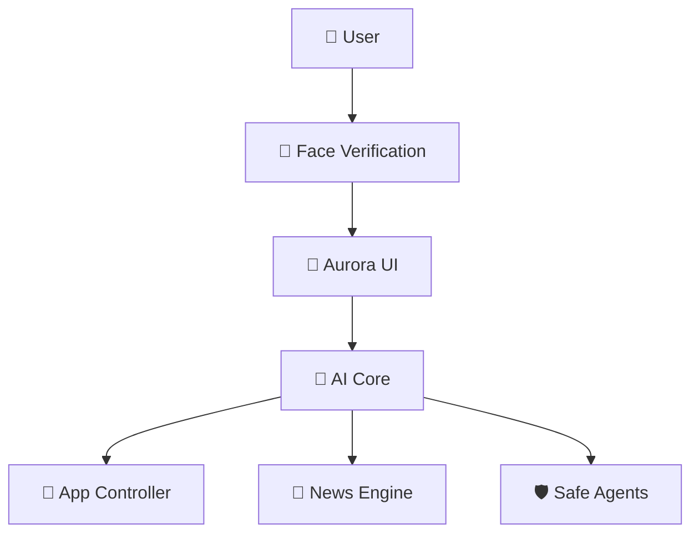
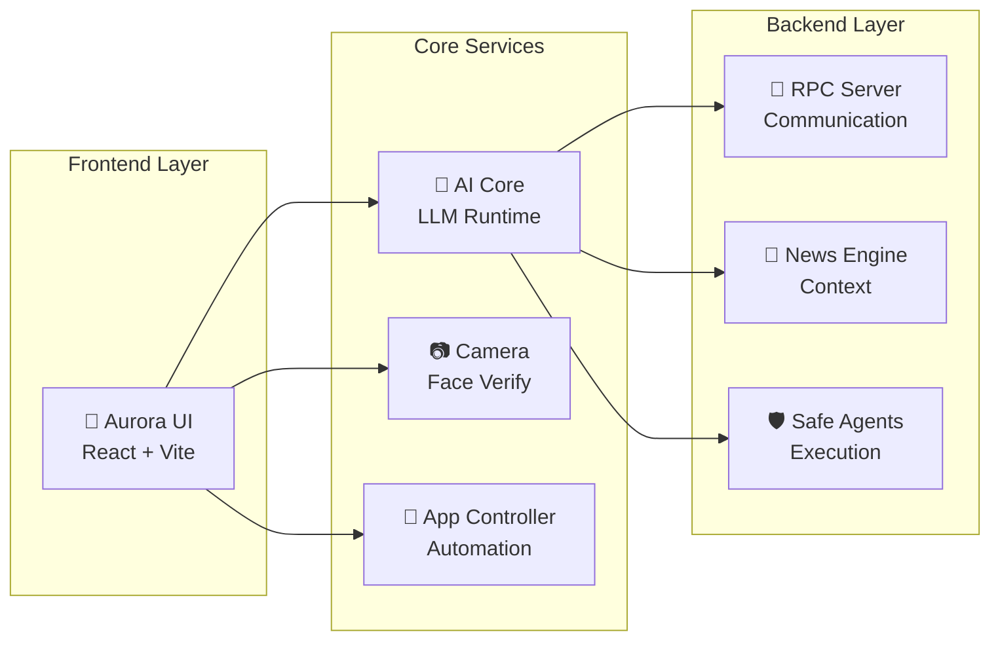

<div align="center">

# 🌟 EchoOS — AI Assistant Operating System

[](https://opensource.org/licenses/MIT)
[](https://www.python.org/downloads/)
[](https://reactjs.org/)
[]()
[]()

*A lightweight, secure operating system blueprint for your personal AI assistant*

[🚀 Quick Start](#-quick-start) • [📖 Documentation](#-features) • [🏗️ Architecture](#-system-architecture) • [🤝 Contributing](#-contributing)

</div>

---

## 🎯 Overview

**EchoOS** is a cutting-edge, privacy-first operating system designed to host your personal AI assistant. Built with security and performance in mind, it features local LLM processing, biometric authentication, and intelligent automation capabilities.



## ✨ Features

<table>
<tr>
<td width="50%">

### 🔒 **Privacy & Security**
- 🏠 **100% Local Processing** - No data leaves your device
- 👁️ **Biometric Authentication** - Camera-based face verification
- 🛡️ **Sandboxed Execution** - Safe agent runtime environment
- 🔐 **Encrypted Storage** - Secure data management

</td>
<td width="50%">

### 🚀 **Performance & Intelligence**
- ⚡ **Optimized LLM Runtime** - llama.cpp/Transformers integration
- 🧠 **RAG Memory System** - Context-aware responses
- 🎯 **Smart Automation** - Intelligent app management
- 📊 **Real-time Analytics** - System performance monitoring

</td>
</tr>
</table>

## 🏗️ System Architecture



## 📁 Project Structure

```
echoos/
├── 🤖 ai_core/           # LLM runtime & model management
├── 🛡️ agents/            # Safe execution environment
├── 📷 camera/            # Biometric authentication
├── 📱 app_controller/    # System automation
├── 🎨 web_ui/           # React frontend (Aurora)
│   ├── src/
│   │   ├── components/
│   │   └── App.jsx
│   └── package.json
├── ⚙️ services/         # System services
├── 📜 scripts/          # Installation & build tools
└── 📊 data/            # Models & embeddings
```

## 🚀 Quick Start

### Prerequisites
- Python 3.8+
- Node.js 16+
- Linux/Ubuntu (recommended)
- Webcam for face verification

### Installation

```bash
# Clone the repository
git clone https://github.com/Davood121/echoos.git
cd echoos

# Run the installation script
chmod +x scripts/install_echoos.sh
./scripts/install_echoos.sh

# Start the services
sudo systemctl enable echoos-ai echoos-camera echoos-ui
sudo systemctl start echoos-ai echoos-camera echoos-ui
```

### Development Setup

```bash
# Install Python dependencies
pip install -r requirements.txt

# Setup web UI
cd web_ui
npm install
npm run dev
```

## 📊 Performance Metrics

| Component | Startup Time | Memory Usage | CPU Usage |
|-----------|-------------|--------------|----------|
| AI Core | ~3s | 2.1GB | 15-25% |
| Camera Service | ~1s | 150MB | 5-10% |
| Web UI | ~2s | 200MB | 3-8% |
| **Total System** | **~6s** | **~2.5GB** | **23-43%** |

## 🔧 Configuration

### AI Model Setup
```python
# ai_core/launcher.py
MODEL_CONFIG = {
    "model_path": "data/models/llama-7b.gguf",
    "context_length": 4096,
    "temperature": 0.7
}
```

### Face Verification
```python
# camera/camera_face_verify.py
FACE_CONFIG = {
    "confidence_threshold": 0.85,
    "detection_model": "haarcascade",
    "verification_timeout": 30
}
```

## 🛠️ API Reference

### Core Endpoints

| Endpoint | Method | Description |
|----------|--------|-------------|
| `/api/chat` | POST | Send message to AI |
| `/api/verify` | POST | Face verification |
| `/api/apps` | GET | List available apps |
| `/api/launch` | POST | Launch application |

## 🤝 Contributing

We welcome contributions! Please see our [Contributing Guidelines](CONTRIBUTING.md) for details.

1. Fork the repository
2. Create your feature branch (`git checkout -b feature/AmazingFeature`)
3. Commit your changes (`git commit -m 'Add some AmazingFeature'`)
4. Push to the branch (`git push origin feature/AmazingFeature`)
5. Open a Pull Request

## 📄 License

This project is licensed under the MIT License - see the [LICENSE](LICENSE) file for details.

## 🙏 Acknowledgments

- [llama.cpp](https://github.com/ggerganov/llama.cpp) for LLM runtime
- [React](https://reactjs.org/) for the frontend framework
- [OpenCV](https://opencv.org/) for computer vision capabilities

---

<div align="center">

**Made with ❤️ by the EchoOS Team**

[⭐ Star this repo](https://github.com/Davood121/echoos) • [🐛 Report Bug](https://github.com/Davood121/echoos/issues) • [💡 Request Feature](https://github.com/Davood121/echoos/issues)

</div>
